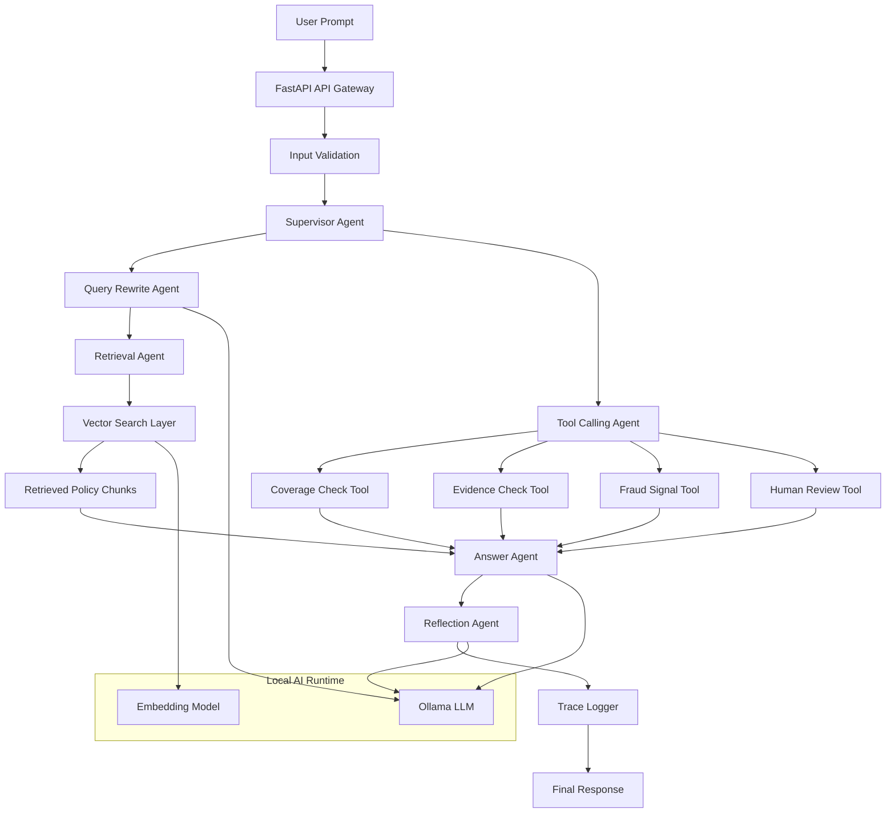
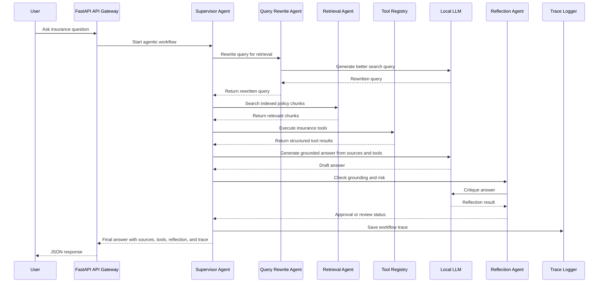
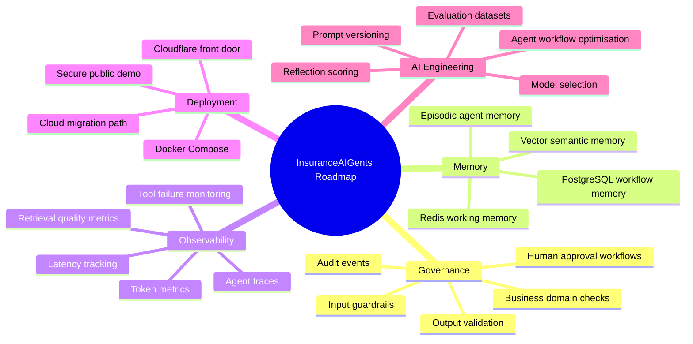

<div align="center">


<br/>


<br/>


</div>

---

# InsuranceAIGents.com

**InsuranceAIGents.com** is a local-first **Agentic RAG Insurance Operations Platform**.

It demonstrates how an enterprise insurance workflow can move beyond a basic chatbot or simple Retrieval Augmented Generation system by using a **Supervisor Agent** to coordinate retrieval, tool calling, reflection, human review decisions, and trace logging before producing a final grounded answer.

The project is designed as an AI engineering showcase for building production-style agentic systems in regulated insurance environments.

---

## One-Line Summary

**InsuranceAIGents.com is an Agentic Retrieval Augmented Generation platform where a Supervisor Agent coordinates document retrieval, insurance tools, reflection checks, human review logic, and traceable decision workflows.**

---

## Why This Project Exists

Insurance workflows are too important for a single free-form chatbot.

A basic chatbot may answer directly from the model's internal knowledge.
A basic RAG system may retrieve a few chunks and then answer.
But insurance use cases require more control.

Claims, policy interpretation, evidence requirements, fraud indicators, compliance checks, and human review decisions need:

* trusted document grounding
* controlled tool calling
* workflow orchestration
* traceability
* reflection and critique
* escalation logic
* audit-friendly outputs

This project implements those ideas through an **Agentic RAG architecture**.

---

## Normal RAG vs Agentic RAG

| Basic RAG                        | InsuranceAIGents.com Agentic RAG                                                          |
| -------------------------------- | ----------------------------------------------------------------------------------------- |
| Query → retrieve chunks → answer | Query → rewrite → retrieve → evaluate context → call tools → answer → reflect → log trace |
| One retrieval step               | Multi-step supervised workflow                                                            |
| Limited control flow             | Supervisor Agent controls the workflow                                                    |
| Usually no tool calling          | Uses controlled insurance tools                                                           |
| Weak auditability                | Stores trace logs and tool results                                                        |
| Model mostly answers directly    | Model is guided by retrieved evidence and structured tool outputs                         |
| No escalation logic              | Supports human review decisions                                                           |

---

## High-Level Agentic Flow

```text
User question
    ↓
Input validation
    ↓
Supervisor Agent
    ↓
Query Rewrite Agent
    ↓
Retrieval Agent
    ↓
Insurance Tool Calling Agent
    ↓
Coverage / Evidence / Fraud / Human Review tools
    ↓
Answer Agent
    ↓
Reflection Agent
    ↓
Trace Logger
    ↓
Final grounded answer
```

---

## Core Capabilities

| Capability               | Description                                                                              |
| ------------------------ | ---------------------------------------------------------------------------------------- |
| **Agentic RAG**          | Retrieval is controlled by a supervisor workflow rather than a single static search step |
| **Supervisor Agent**     | Coordinates query rewriting, retrieval, tool calling, answer generation, and reflection  |
| **Query Rewrite Agent**  | Converts user questions into more precise retrieval queries                              |
| **Retrieval Agent**      | Searches indexed insurance document chunks                                               |
| **Tool Calling Agent**   | Calls approved insurance tools through a controlled registry                             |
| **Coverage Tool**        | Checks whether the claim appears related to covered events or exclusions                 |
| **Evidence Tool**        | Identifies likely evidence required for claim assessment                                 |
| **Fraud Tool**           | Detects simple fraud risk indicators from claim wording                                  |
| **Human Review Tool**    | Decides whether a case should be escalated                                               |
| **Reflection Agent**     | Reviews answer grounding, risk, and source support                                       |
| **Trace Logger**         | Records each workflow step for auditability and debugging                                |
| **Local LLM Serving**    | Uses local model serving through Ollama during development                               |
| **Token-Aware Chunking** | Splits documents into manageable chunks with overlap                                     |
| **Structured Outputs**   | Returns sources, tool calls, reflection status, and trace information                    |

---

## Architecture



---

## Agentic RAG Sequence



---

## Agent Roles

| Agent                   | Responsibility                                                      |
| ----------------------- | ------------------------------------------------------------------- |
| **Supervisor Agent**    | Owns the workflow and decides what steps happen                     |
| **Query Rewrite Agent** | Rewrites vague user questions into retrieval-friendly queries       |
| **Retrieval Agent**     | Searches document chunks using semantic similarity                  |
| **Tool Calling Agent**  | Executes approved tools from the registry                           |
| **Answer Agent**        | Generates the final answer using retrieved context and tool outputs |
| **Reflection Agent**    | Reviews whether the answer is grounded and safe                     |
| **Trace Logger**        | Saves the full execution path for debugging and auditability        |

---

## Tool Calling Design

The project uses a **controlled tool registry**.

A **tool** is a backend function the agent can call to perform a specific task.

A **tool registry** is a catalogue of approved tools. Each registered tool has:

```text
name
description
input schema
execution function
structured output
trace log entry
```

This prevents the model from taking uncontrolled actions.

Current tools:

| Tool                  | Purpose                                                                      |
| --------------------- | ---------------------------------------------------------------------------- |
| `coverage_check_tool` | Checks whether claim wording appears related to covered events or exclusions |
| `evidence_check_tool` | Identifies likely evidence required for assessment                           |
| `fraud_signal_tool`   | Detects simple fraud indicators from claim wording                           |
| `human_review_tool`   | Decides whether the case should be escalated                                 |

---

## Retrieval and Chunking Pipeline


The current document pipeline supports:

* document ingestion
* text extraction
* text cleaning
* token estimation
* chunking with overlap
* metadata tracking
* local embedding generation
* local vector indexing
* semantic search
* grounded answer generation
* agentic orchestration on top of retrieved results

---

## Why Chunking Matters

Long insurance documents cannot be sent to a Large Language Model all at once.

The system breaks documents into smaller chunks and adds overlap between chunks.
Overlap helps preserve meaning when important policy clauses sit across chunk boundaries.

Each chunk stores:

```text
document ID
chunk ID
chunk index
source filename
text
estimated token count
metadata
```

This makes retrieval more accurate and improves traceability.

---

## API Endpoints

| Endpoint                   | Purpose                                      |
| -------------------------- | -------------------------------------------- |
| `GET /`                    | Basic API status                             |
| `GET /health`              | Dependency health check                      |
| `POST /llm/test`           | Test local Large Language Model generation   |
| `POST /documents/ingest`   | Upload, clean, and chunk a document          |
| `POST /rag/index`          | Convert chunks into embeddings               |
| `POST /rag/search`         | Search indexed document chunks               |
| `POST /rag/answer`         | Generate a basic grounded RAG answer         |
| `GET /tools/list`          | List available tools                         |
| `POST /tools/execute`      | Execute a registered tool                    |
| `POST /agentic/rag-answer` | Run the full Agentic RAG supervisor workflow |

---

## Main Endpoint

The main project endpoint is:

```text
POST /agentic/rag-answer
```

This endpoint runs the full Agentic RAG workflow:

```text
query rewrite
semantic retrieval
tool calling
grounded answer generation
reflection
trace logging
```

---

## Technology Stack

| Layer                  | Technology                            |
| ---------------------- | ------------------------------------- |
| Backend API            | FastAPI                               |
| Local model serving    | Ollama                                |
| LLM access             | Local HTTP API                        |
| Embeddings             | Local embedding model                 |
| Vector search          | Local vector index for MVP            |
| Future vector database | Qdrant                                |
| Short-term memory      | Redis planned                         |
| Persistent storage     | PostgreSQL planned                    |
| Containerisation       | Docker Compose planned                |
| Observability          | Trace logs now, OpenTelemetry planned |
| Frontend               | Planned                               |

---

## Project Structure

```text
insurance-aigents.com/
    backend/
        app/
            api/
            agents/
            core/
            memory/
            models/
            observability/
            rag/
            schemas/
            services/
        requirements.txt
        run_local_api.py

    docs/
    docker-compose.yml
    README.md
```

Generated local data is intentionally excluded from GitHub:

```text
data/uploads/
data/indexes/
data/logs/
```

---

## Example Agentic Request

```json
{
  "query": "The customer has windscreen damage after a storm. Is it covered and what evidence is required?",
  "document_id": null,
  "top_k": 3,
  "max_loops": 2
}
```

---

## Example Agentic Response Shape

```json
{
  "query": "The customer has windscreen damage after a storm. Is it covered and what evidence is required?",
  "rewritten_query": "windscreen storm damage insurance coverage evidence requirements",
  "answer": "Windscreen damage may be covered when comprehensive cover is active. The claim may require photographs, an incident description, repair quote, and policy details. The response is based on the retrieved policy chunk and structured tool outputs.",
  "status": "approved",
  "llm_model": "llama3.1:8b",
  "embedding_model": "nomic-embed-text",
  "total_sources_used": 1,
  "sources": [
    {
      "document_id": "example-document-id",
      "chunk_id": "example-document-id_chunk_0001",
      "chunk_index": 1,
      "score": 0.82,
      "source_filename": "sample_policy.txt",
      "text": "Windscreen damage is covered when the insured vehicle has comprehensive cover active at the time of the incident."
    }
  ],
  "tool_calls": [
    {
      "tool_name": "coverage_check_tool",
      "ok": true,
      "result": {
        "coverage_status": "potentially_covered"
      }
    },
    {
      "tool_name": "evidence_check_tool",
      "ok": true,
      "result": {
        "required_evidence": [
          "incident description",
          "photographs of damage",
          "repair invoice or quote",
          "policy number",
          "windscreen repair or replacement quote"
        ]
      }
    },
    {
      "tool_name": "fraud_signal_tool",
      "ok": true,
      "result": {
        "fraud_risk_level": "low",
        "fraud_risk_score": 0
      }
    },
    {
      "tool_name": "human_review_tool",
      "ok": true,
      "result": {
        "human_review_required": false
      }
    }
  ],
  "reflection": {
    "approved": true,
    "risk_level": "low",
    "human_review_required": false
  },
  "trace_id": "example-trace-id",
  "loop_count": 1
}
```

---

## What Makes This Different From A Chatbot

| Chatbot                   | InsuranceAIGents.com                                |
| ------------------------- | --------------------------------------------------- |
| Answers directly          | Runs a supervised Agentic RAG workflow              |
| No retrieval control      | Uses query rewriting and semantic retrieval         |
| No controlled tools       | Uses an approved tool registry                      |
| Hard to audit             | Saves trace logs                                    |
| May hallucinate           | Uses grounded context, tool outputs, and reflection |
| One model does everything | Supervisor coordinates specialist agents            |
| No escalation logic       | Supports human review decisioning                   |

---

## Local Development Status

```text
Completed:
    ✓ FastAPI backend foundation
    ✓ Local LLM endpoint
    ✓ Document ingestion
    ✓ Token-aware chunking
    ✓ Local vector indexing
    ✓ Semantic search
    ✓ Basic RAG answer generation
    ✓ Agentic RAG supervisor workflow
    ✓ Controlled insurance tool registry
    ✓ Tool calling inside supervisor workflow
    ✓ Trace logging

Next:
    → Input guardrails
    → Business domain classifier
    → Intent classifier
    → Prompt decomposition
    → Redis memory
    → PostgreSQL audit persistence
    → Qdrant vector database migration
    → Frontend dashboard
    → Observability dashboards
```

---

## Planned Enterprise Enhancements



---

## Local Setup

This project is currently designed as a local-first MVP.

Create and activate a Python virtual environment:

```bash
cd backend
python -m venv .venv
.venv\Scripts\activate
python -m pip install -r requirements.txt
python run_local_api.py
```

Open API docs:

```text
http://127.0.0.1:8000/docs
```

---

## Local Model Setup

The local development version uses Ollama.

Example models:

```bash
ollama pull llama3.1:8b
ollama pull nomic-embed-text
```

`llama3.1:8b` is used for local text generation.
`nomic-embed-text` is used for local embeddings.

---

## Security Notes

This repository intentionally avoids committing:

```text
environment files
local virtual environments
uploaded documents
generated indexes
agent trace logs
API keys
tokens
passwords
local machine paths
Cloudflare tunnel credentials
private customer data
```

The public repository should contain source code, documentation, configuration templates, and safe example material only.

---

## Engineering Principles

This project is built around the following principles:

* agent-first workflow design
* retrieval before generation
* controlled tool calling
* source-grounded responses
* human review for uncertain or risky outputs
* traceable execution
* local-first experimentation
* clean migration path to cloud infrastructure

---

## Interview Positioning

This project demonstrates hands-on capability across:

* Agentic AI system design
* Agentic Retrieval Augmented Generation
* Multi-step orchestration
* Supervisor and worker agent patterns
* Tool calling through a controlled registry
* Context engineering
* Local model serving
* Human review patterns
* Traceability and auditability
* Insurance-domain AI decision support
* Production-minded AI engineering

---

<div align="center">


</div>
