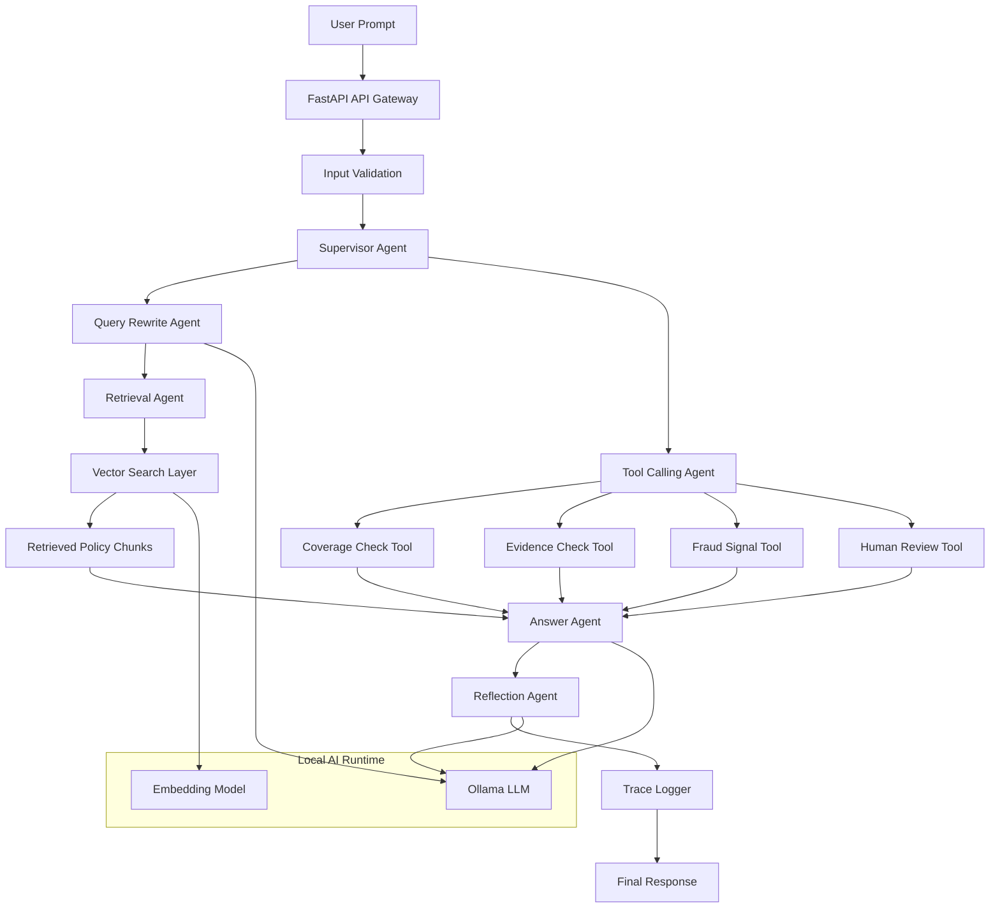
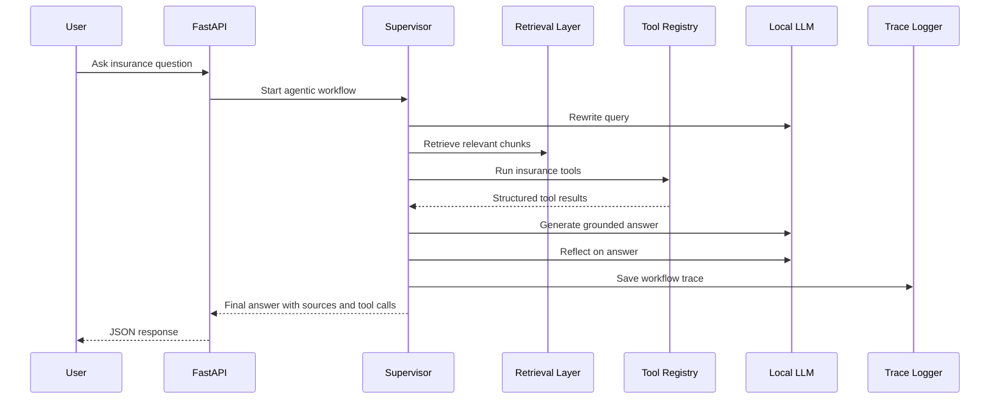
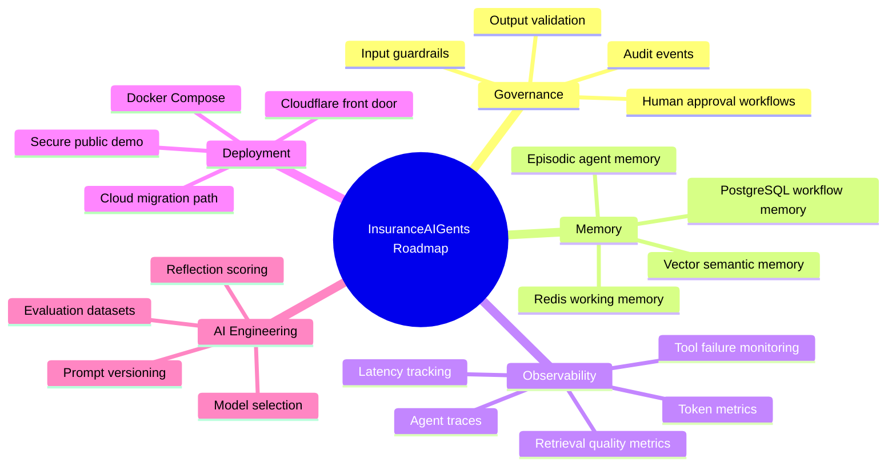

<div align="center">


<br/>


<br/>


</div>

---

# InsuranceAIGents.com

**InsuranceAIGents.com** is a local-first enterprise AI engineering showcase project for building **agentic insurance operations workflows** using multi-agent orchestration, Retrieval Augmented Generation, controlled tool calling, trace logging, and human review decision patterns.

This project is designed to demonstrate how an insurance organisation could move beyond a simple chatbot and toward a safer, more observable, and more governable AI decision-support platform.

---

## Why This Project Exists

Insurance workflows are complex. Claims, policy interpretation, fraud signals, evidence requirements, compliance checks, and human review decisions cannot be handled safely by a single free-form chatbot.

This project uses a more enterprise-ready pattern:

```text
User question
    ↓
Input validation
    ↓
Supervisor Agent
    ↓
Query rewriting
    ↓
Document retrieval
    ↓
Insurance tool calling
    ↓
Grounded answer generation
    ↓
Reflection and review
    ↓
Traceable final response
```

---

## Core Capabilities

| Capability               | Description                                                     |
| ------------------------ | --------------------------------------------------------------- |
| **Agentic RAG**          | Retrieves relevant policy context before generating an answer   |
| **Supervisor Agent**     | Controls the workflow and coordinates specialist steps          |
| **Query Rewrite Agent**  | Converts user questions into better retrieval queries           |
| **Retrieval Agent**      | Searches indexed insurance document chunks                      |
| **Tool Calling Agent**   | Calls approved insurance tools through a controlled registry    |
| **Reflection Agent**     | Reviews answer quality, grounding, and risk                     |
| **Trace Logging**        | Records each agent step for auditability and debugging          |
| **Human Review Logic**   | Escalates uncertain or risky cases instead of blindly approving |
| **Local LLM Serving**    | Uses local model serving through Ollama during development      |
| **Token-Aware Chunking** | Splits documents into manageable chunks with overlap            |

---

## Architecture



---

## Current Local Workflow



---

## Tool Calling Design

The project uses a **controlled tool registry**.

A tool registry is a catalogue of approved backend functions the agent is allowed to call. This prevents the model from taking uncontrolled actions.

Current tools:

| Tool                  | Purpose                                                                  |
| --------------------- | ------------------------------------------------------------------------ |
| `coverage_check_tool` | Checks whether the claim appears related to covered events or exclusions |
| `evidence_check_tool` | Identifies likely claim evidence requirements                            |
| `fraud_signal_tool`   | Detects simple fraud indicators from claim wording                       |
| `human_review_tool`   | Decides whether the case should be escalated                             |

Each tool has:

```text
name
description
input schema
execution function
structured output
trace log entry
```

---

## Retrieval Augmented Generation Pipeline


The current RAG pipeline supports:

* Document ingestion
* Text extraction
* Text cleaning
* Token estimation
* Chunking with overlap
* Metadata tracking
* Local embedding generation
* Semantic vector search
* Grounded answer generation

---

## API Endpoints

| Endpoint                   | Purpose                                    |
| -------------------------- | ------------------------------------------ |
| `GET /`                    | Basic API status                           |
| `GET /health`              | Dependency health check                    |
| `POST /llm/test`           | Test local Large Language Model generation |
| `POST /documents/ingest`   | Upload and chunk a document                |
| `POST /rag/index`          | Convert chunks into embeddings             |
| `POST /rag/search`         | Search indexed document chunks             |
| `POST /rag/answer`         | Generate a grounded RAG answer             |
| `GET /tools/list`          | List available tools                       |
| `POST /tools/execute`      | Execute a registered tool                  |
| `POST /agentic/rag-answer` | Run the full agentic RAG workflow          |

---

## Technology Stack

| Layer                    | Technology                            |
| ------------------------ | ------------------------------------- |
| Backend API              | FastAPI                               |
| Local model serving      | Ollama                                |
| Language model interface | Local HTTP API                        |
| Embeddings               | Local embedding model                 |
| Vector search            | Local vector index for MVP            |
| Future vector database   | Qdrant                                |
| Short-term memory        | Redis planned                         |
| Persistent storage       | PostgreSQL planned                    |
| Containerisation         | Docker Compose planned                |
| Observability            | Trace logs now, OpenTelemetry planned |
| Frontend                 | Planned                               |

---

## Project Structure

```text
insurance-aigents.com/
    backend/
        app/
            api/
            agents/
            core/
            memory/
            models/
            observability/
            rag/
            schemas/
            services/
        requirements.txt
        run_local_api.py

    data/
        uploads/
        indexes/
        logs/

    docs/
    docker-compose.yml
    README.md
```

---

## Example Agentic Response Shape

```json
{
  "query": "The customer has windscreen damage after a storm. Is it covered and what evidence is required?",
  "rewritten_query": "windscreen storm damage insurance coverage evidence requirements",
  "status": "approved",
  "llm_model": "llama3.1:8b",
  "embedding_model": "nomic-embed-text",
  "total_sources_used": 1,
  "tool_calls": [
    {
      "tool_name": "coverage_check_tool",
      "ok": true,
      "result": {
        "coverage_status": "potentially_covered"
      }
    },
    {
      "tool_name": "evidence_check_tool",
      "ok": true,
      "result": {
        "required_evidence": [
          "incident description",
          "photographs of damage",
          "repair invoice or quote"
        ]
      }
    }
  ],
  "reflection": {
    "approved": true,
    "risk_level": "low",
    "human_review_required": false
  }
}
```

---

## What Makes This Different From A Chatbot

| Chatbot                   | InsuranceAIGents.com                    |
| ------------------------- | --------------------------------------- |
| Answers directly          | Retrieves evidence first                |
| No controlled tools       | Uses an approved tool registry          |
| Hard to audit             | Saves trace logs                        |
| May hallucinate           | Uses grounded context and reflection    |
| One model does everything | Supervisor coordinates specialist steps |
| No escalation logic       | Supports human review decisioning       |

---

## Local Development Status

```text
Completed:
    ✓ FastAPI backend foundation
    ✓ Local LLM endpoint
    ✓ Document ingestion
    ✓ Token-aware chunking
    ✓ Local vector indexing
    ✓ Semantic search
    ✓ Basic RAG answer generation
    ✓ Agentic RAG supervisor workflow
    ✓ Controlled insurance tool registry
    ✓ Tool calling inside supervisor workflow
    ✓ Trace logging

Next:
    → Input guardrails
    → Business domain classifier
    → Intent classifier
    → Prompt decomposition
    → Redis memory
    → PostgreSQL audit persistence
    → Qdrant vector database migration
    → Frontend dashboard
    → Observability dashboards
```

---

## Planned Enterprise Enhancements



---

## Local Setup

> This project is currently designed as a local-first MVP.

Install backend dependencies:

```bash
cd backend
python -m venv .venv
.venv\Scripts\activate
python -m pip install -r requirements.txt
python run_local_api.py
```

Open API docs:

```text
http://127.0.0.1:8000/docs
```

---

## Security Notes

This repository intentionally avoids committing:

```text
environment files
local virtual environments
uploaded documents
generated indexes
agent trace logs
API keys
tokens
passwords
local machine paths
Cloudflare tunnel credentials
private customer data
```

The public repository should contain source code, documentation, configuration templates, and safe example material only.

---

## Interview Positioning

This project demonstrates hands-on capability across:

* Agentic AI system design
* Multi-step orchestration
* Retrieval Augmented Generation
* Context engineering
* Tool calling
* Local model serving
* Controlled AI workflows
* Human review patterns
* Traceability and auditability
* Insurance-domain AI decision support
* Production-minded AI engineering

---

<div align="center">


</div>
